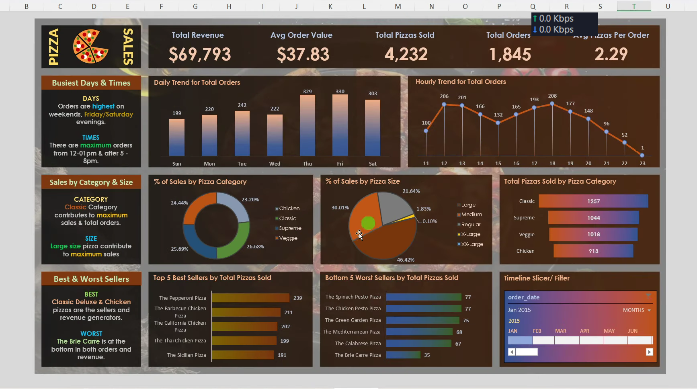
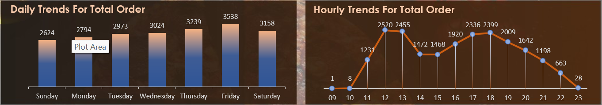
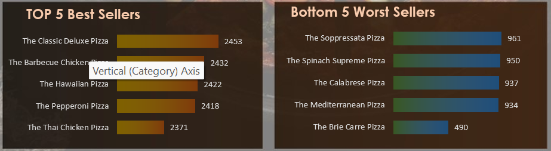

# Pizza Sales Analysis (SQL + Excel Dashboard)

## Overview
This project analyzes pizza sales data using SQL for data cleaning and querying, and Excel for building an interactive dashboard. The goal is to identify sales trends, customer behavior, and key business insights.

## Tools Used
- SQL Server (Data Cleaning & Analysis)
- Microsoft Excel (Pivot Tables, Charts, Dashboard)

## KPIs
- Total Revenue: $817,860
- Total Orders: 21,350
- Total Pizzas Sold: 49,574
- Average Order Value: $38.31
- Average Pizzas per Order: 2.32

## Dashboard Features
- Daily and hourly sales trends
- Sales by category (Donut Chart)
- Sales by size (Pie Chart)
- Top 5 best-selling pizzas
- Bottom 5 worst-selling pizzas
- KPI summary cards

## Key Insights
- Highest orders occur on weekends (Friday & Saturday)
- Peak order time: 12–1 PM and 5–8 PM
- Certain pizza categories generate higher revenue
- Large size pizzas contribute most to sales
- Few pizzas dominate total sales (Pareto effect)

## Workflow
1. Cleaned raw data using SQL
2. Performed analysis using SQL queries
3. Loaded cleaned data into Excel
4. Created pivot tables
5. Built interactive dashboard

## Business Impact
This dashboard helps in identifying sales trends and improving decision-making for product strategy.   

## Dashboard Preview

# KPI Section

# Sales Trends

# Top & Worst PIzzas

## SQL Analysis
All SQL queries used for data cleaning and analysis are available in queries.sql

## Key Business Insights

Detailed insights are available in:
Business_insights.md

## Project Workflow

1. Raw pizza sales dataset was imported into SQL Server.
2. Data cleaning and preprocessing were performed using SQL queries.
3. Business-related SQL analysis was conducted to identify trends and KPIs.
4. Cleaned data was loaded into Excel for reporting.
5. Pivot tables and charts were created for analysis.
6. An interactive dashboard was developed in Excel to visualize sales performance and customer ordering trends.
7. Business insights and recommendations were generated based on the analysis.
